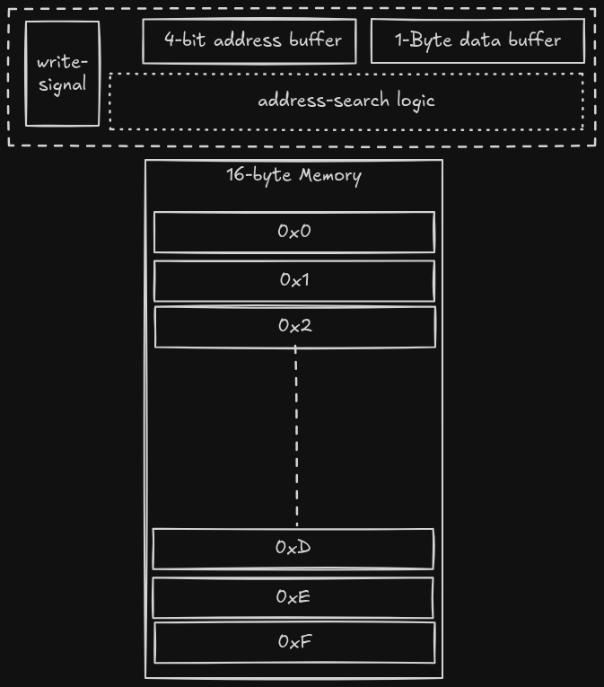
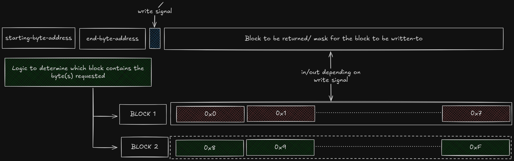
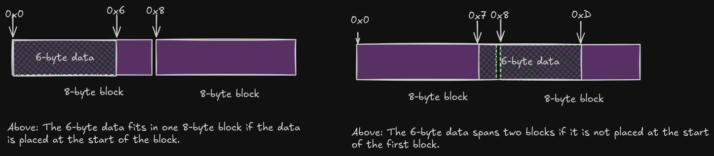

# Memory Alignment  

Memory Alignment is the process of placing data in a starting address that is a multiple of a certain number. (typically a power of 2)
For example, if you say that data_x has an alignment of 2, it means that data_x's starting-address will be divisible by 2. eg address 0x0004.  
If data_y has an alignment of 3, it means that the starting address of y is something like 0x0009.  

This does not make sense. Why should the starting address be placed there? Why can't I place it in any address of my choosing? Why should we align things?  

I will answer 2 questions:
1. How hardware is designed in such a way that it makes data-alignment necessary
2. Why are programmers forced to align their data-structures. What are the consequences  

## The Hardware  
Memory systems in computers are typically made up of hierarchies:
1. Registers
2. Cache
3. RAM
4. ROM/ hard-disk

Memory operations that involve data transfer btwn the CPU vs the cache, RAM or Hard-disk are collectively refered to as `off-chip memory operations`. Memory operations involving registers are called `on-chip memory operations`

We are going to cover 2 fundamental disasters.  
1. Data from memory is fetched in blocks instead of bytes
2. The starting and ending address for each block is enforced in hardware. The blocks are not virtual, they are physical.  

### The block disaster: Machines fetch memory in blocks

In the programmer's perfect-world-fantasy, a memory system like a RAM or the Hard-disk is made up of byte-sized memory units that can be referenced using unique addresses. like shown below: 

<figure>
  
  <figcaption><i>Simple 16-byte memory where each fetch and write operation affects one byte only </i></figcaption>
</figure>

This memory system is byte-addressable... it is so granular to the point that you can single out a single byte when reading or writing.  

This memory system has a `write_signal_flag`, a `data buffer` and an `address buffer`.  
When the `write_signal_flag` is true, the data in the `data buffer` is written to the memory unit (1-byte memory unit) whose address got specified in the `address buffer`.  
When the `write_signal_flag` is false, the memory system reads from the memory unit (1-byte unit) whose address is specified in the `address buffer` and stores that data in the `data buffer`.  

In this hypothetical world, you can write code like :
- 'fetch one byte from address `0x0`' and you would expect that the memory system will return ONLY one-byte of data
- 'fetch three bytes from address `0x3` and you would expect that the cpu will **make 3 seperate 1-byte reads in succession**.  

However, in the real world, you cannot just fetch a single byte from memory, you are instead forced to fetch multiple bytes at once. Here are the reasons for this reality:  

1. Off-chip Memory operations are very expensive in terms of both power and time. So it is best to reduce the number of fetches/writes.  For this reason, hard-disks and RAMS are hardwired to fetch blocks of multiple bytes in one fetch **instead** of single-bytes in multiple fetches. This method of fetching blocks give the memory_processor/CPU the work of filtering out the un-needed bytes; let us call this **filtering**. You could argue that fetching blocks reduced the number of single-byte fetches at the cost of introducing new filtering operations. But this extra work of filtering is acceptable because a single on-board cpu opertation is ~60 times cheaper than a memory operation in terms of power. The same CPU operation is typically more than 1000 times faster than a memory operation. So it makes sense to make the CPU do filtration work for the advantage of experiencing fewer off-chip memory operations. In Short, a couple of filtering operation are thousands of times cheaper than a single off-chip memory operation.

2. From a hardware perspective, making a Memory system that can fetch individual bytes requires more hardware(wiring & transistors) than a memory system that fetches blocks. A byte-addressable memory is will need more wiring and transistors that will be needed to perform address searches 

The above 2 reasons are not exhaustive, there are more reasons as to why data from RAM & hard-disks are fetched in blocks. But anyway, I hope you get the drift...it is an expense trade-off.  

Oh, and here is an image of a block memory system :  

<figure>
  
  <figcaption><i>the earlier byte-addressable memory has now been flattened into blocks... the memory is now block-addressable, it is up to the cpu to break down the block into individual bytes</i></figcaption>
</figure>

### Block Implementation Disaster : Blocks are physicaly implemented 
You already understand why memory fetches are done in blocks instead of bytes. Now I want to explain why each block starts on known pre-determined physical addresses.  

There are generally 2 ways of implementing a block-memory system. There are dozens of ways, but they boil down to 2 schools of thought.
1. You could use virtual blocks, where the memory system is truly a stream of bytes and you are free to request blocks of different sizes that start at arbitrary addresses. The hardware has a mechanism to fetch blocks of variable sizes.  
2. You could use physical blocks where the blocks are physically implemented in the circuitry. The block addresses and sizes are fixed.

Under virtual blocks, you could have a memory system that receives an arbitrary starting address & block size as input. From there, the memory system returns the requested block. This means that this memory system is dynamic. For example, if the data you need is 1-byte long, you will get exactly that without the need for making the cpu filter. If you need 6 bytes, congrats... you get just that. Very good. Perfect! But the circuitry required to implement this is expensive and complicated. (but it is doable & efficient).  

Under physical blocks, you could have a memory system that is physically divided into blocks. It receives an arbitrary byte-address, it calculates the block-address where that byte-address is, and it returns the entire block that contains the targeted byte.  

The problem with the physical approach is that it is wasteful; if a data structure spans 2 blocks like shown below, if fetches 2 entire blocks. However, a virtual system would have made one fetch.  

<figure>
  
  <figcaption><i>Visual demo of the effect of placing the starting address of data structures in the "middle" of blocks instead of the starting address</i></figcaption>
</figure>

A quick solution under the physical system, is to make sure that items are stored at the beginning of blocks in order to avoid spanning.  

Most memory systems are built using physical blocks. That is why we are usually adviced to place our data-structures at the beginning of blocks. (Most block designers put them at addresses that are powers of 2... you get the drift)  

I am done explaining why the hardware focuses us to align memory addresses to addresses that are multiples of the power of 2. It is because we want to avoid multiple fetches due to spanning. It is better to experience spanning because your requested data was too big to fit in a single block instead of experiencing it just because you did not optimally place it at the start of the block.  

## Effects of Not following alignment rules

I will classify the effects into two:
1. Group 1: Valid reasons that cut across common ISA implementations
2. Group 2: Valid reasons that could be fixed by using an ISA with different features

#### Group 1
1. Performance Penalties : Unaligned accesses degrade performance due to Extra Memory Operations and over-crowding the cache.  

#### Group 2
1. Occasional Atomicity violations in niche architectures: some CPUs guarantee atomicity only for naturally aligned accesses, the multiple memory operations introduced by misaligned data breaks atomicity and may cause undefined behaviour or failures. 
2. Some CPUs throw exceptions when instructed to fetch from misaligned addresses.  

## More...
There is more to memory alignment that is not covered here, for example:  
1. Code Optimization strategies that take advantage of alignment : Mess around with the memory-layouts of data structures to get better memory usage and memory performance
2. More explanations on how alignment affects atomicity & how to handle their occurences in different ISAs  

# NOTE
Most modern processors counter the effects of misalignment using better hardware designs and optimizations to the point that programmers don't have to worry about them. Furthermore, compilers take care of adherance to alignment rules and even perform lay-out optimizations or optimal performance.  